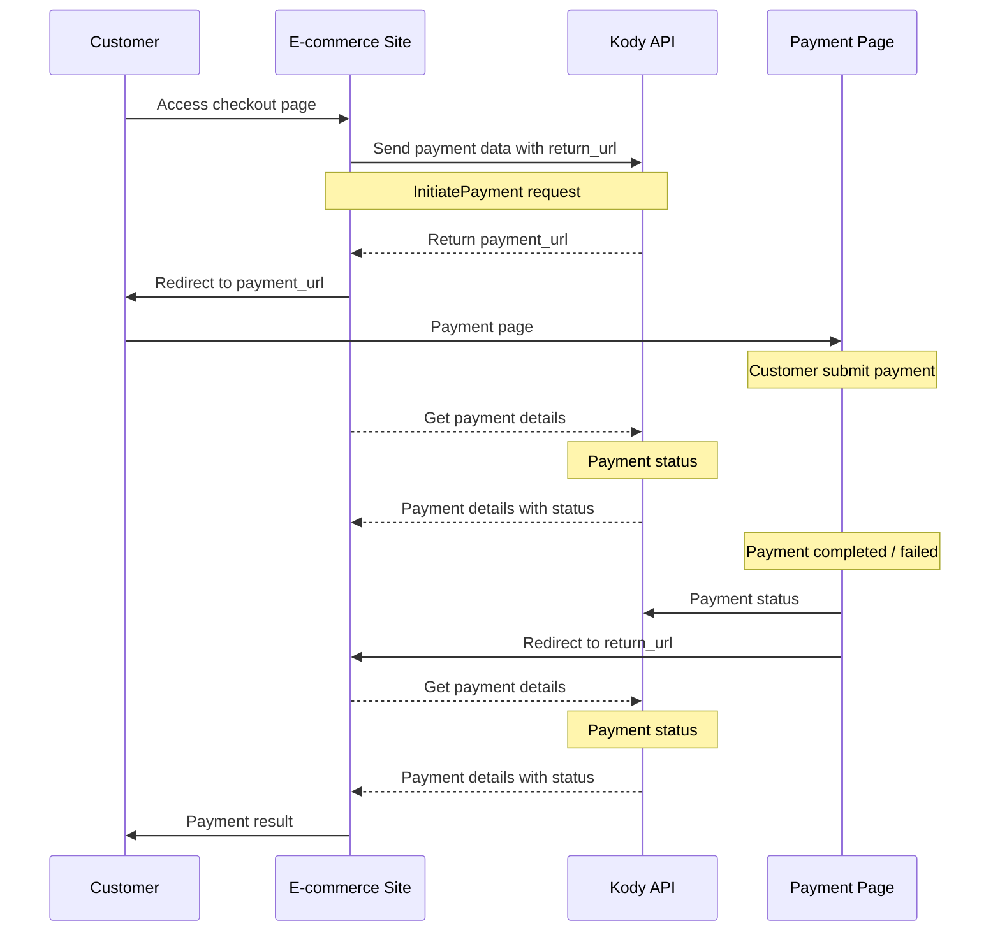

# Kody Payments API Documentation

- Kody API
    - [Client Libraries SDK](https://www.notion.so/Kody-Payments-API-Documentation-e26a60bace804508a3a30bda512a29c8?pvs=21)
        - [Authentication](https://www.notion.so/Kody-Payments-API-Documentation-e26a60bace804508a3a30bda512a29c8?pvs=21)
        - [Payments API](https://www.notion.so/Kody-Payments-API-Documentation-e26a60bace804508a3a30bda512a29c8?pvs=21)
            - [Online Payments](https://www.notion.so/Kody-Payments-API-Documentation-e26a60bace804508a3a30bda512a29c8?pvs=21)
                - [Initiate Payment](https://www.notion.so/Kody-Payments-API-Documentation-e26a60bace804508a3a30bda512a29c8?pvs=21)
                - [Payment Details](https://www.notion.so/Kody-Payments-API-Documentation-e26a60bace804508a3a30bda512a29c8?pvs=21)
                - [Get Payments](https://www.notion.so/Kody-Payments-API-Documentation-e26a60bace804508a3a30bda512a29c8?pvs=21)
            - Terminal Payments
    - [HTTP Direct API](https://www.notion.so/Kody-Payments-API-Documentation-e26a60bace804508a3a30bda512a29c8?pvs=21)
        - [Generate client libraries](https://www.notion.so/Kody-Payments-API-Documentation-e26a60bace804508a3a30bda512a29c8?pvs=21)
    - [Test Card Payments](https://www.notion.so/Kody-Payments-API-Documentation-e26a60bace804508a3a30bda512a29c8?pvs=21)
    - [Go Live](https://www.notion.so/Kody-Payments-API-Documentation-e26a60bace804508a3a30bda512a29c8?pvs=21)
    

This documentation outlines the integration process for Kody payment services, enabling both in-person terminal payments and online payments.

# Kody API

There are two options to integrate with Kody API:

- [**Client Libraries SDK**](https://www.notion.so/Kody-Payments-API-Documentation-e26a60bace804508a3a30bda512a29c8?pvs=21)
    - Ready to use in multiple programming languages. All methods, data objects, serialisation and network communication handled by the library. We recommend that you use this option because of its advantages over building all the code required to handle the network protocols.
- [**HTTP direct calls**](https://www.notion.so/Kody-Payments-API-Documentation-e26a60bace804508a3a30bda512a29c8?pvs=21)
    - Communicate directly with the Kody API service endpoint, implementing the http client code.

# **Client Libraries SDK**

Kody API is designed to be a server ↔ server communication for security reasons. The client sdk should be implemented on a server side infrastructure, so that credentials are not possibly compromised on a frontend application.

### Available languages

The SDK libraries are available in the popular languages:

- Python: [https://github.com/KodyPay/kody-clientsdk-python/](https://github.com/KodyPay/kody-clientsdk-python/)
- Java : [https://github.com/KodyPay/kody-clientsdk-java/](https://github.com/KodyPay/kody-clientsdk-java/)
- PHP: [https://github.com/KodyPay/kody-clientsdk-php/](https://github.com/KodyPay/kody-clientsdk-php/)
- .Net: [https://github.com/KodyPay/kody-clientsdk-dotnet/](https://github.com/KodyPay/kody-clientsdk-dotnet/)

If your programming language is supported by the client libraries, we recommend that you use this option because of its [advantages over building all the code](https://www.notion.so/Kody-Payments-API-Documentation-e26a60bace804508a3a30bda512a29c8?pvs=21) required to handle the network and serialisation protocols. 

If your coding language is not listed, please let the Kody team know and we will be able to create it for you.

## Authentication

The authentication to Kody API is a combination of a **Store ID** and an **API key**. These will be shared with you during the technical integration onboarding or by your Kody contact.

During development, you will have access to a test Store and test API key, and when the integration is ready for live access, the production credentials will be shared securely with you and linked with a live store that was onboarded on Kody.

The test and live API calls are always compatible, only changing credentials and the service hostname.

<aside>
🛠

### Host names

- Development and test: `https://grpc-staging.kodypay.com`
- Live: `https://grpc.kodypay.com`
</aside>

### Authentication examples:

Java

```java
// Create a client connection with the authentication setting
private KodyEcomPaymentsServiceGrpc.KodyEcomPaymentsServiceBlockingStub **kodyEcomPaymentsClient**() {
	Metadata metadata = new Metadata();
	metadata.put(Metadata.Key.of("X-API-Key", Metadata.ASCII_STRING_MARSHALLER), "API_KEY");
	return KodyEcomPaymentsServiceGrpc.newBlockingStub(ManagedChannelBuilder
	        .forAddress("HOSTNAME", 443)
	        .idleTimeout(3, TimeUnit.MINUTES).keepAliveTimeout(3, TimeUnit.MINUTES)
	        .intercept(MetadataUtils.newAttachHeadersInterceptor(metadata))
	        .build());
}

// Configure the request parameters
GetPaymentsRequest getPaymentsRequest = GetPaymentsRequest.newBuilder()
        .setStoreId("STORE ID")
        .setPageCursor(PageCursor.newBuilder().setPageSize(10)).build();

// Call the service to get a response
GetPaymentsResponse payments = **kodyEcomPaymentsClient**().getPayments(getPaymentsRequest);
```

# Payments API

The Payments API allow initiating and managing payments on both online and in person payments with a card reader, also called terminal payments.

## Online Payments

Here's a sequence diagram showing the e-commerce payment flow:



This flow matches the Kody API payment initiation process where the merchant sends payment details including a return URL and receives a payment URL that the customer uses to complete their payment.

### Initiate Payment

**Service call:** `KodyEcomPaymentsService.InitiatePayment`

Sets up a new payment to be paid online by the user on a browser, according to the [sequence diagram](https://www.notion.so/Kody-Payments-API-Documentation-e26a60bace804508a3a30bda512a29c8?pvs=21) above. 

The response includes a `payment_url` that the user browser should open. After the user pays, cancels or expires the payment page, it will redirect to the defined `return_url` in the payment initiation request.

If the `return_url` was not called because of the user closing the browser, user network problem, or any other reason, the `payment_id` can be used to [get the payment details](https://www.notion.so/Kody-Payments-API-Documentation-e26a60bace804508a3a30bda512a29c8?pvs=21) and poll its the status.

```protobuf
rpc InitiatePayment(PaymentInitiationRequest) returns (PaymentInitiationResponse);

message PaymentInitiationRequest {
  string store_id = 1; // Your Kody store id
  string payment_reference = 2; // Your unique reference of this payment request.
  uint64 amount = 3; // Amount in minor units. For example, 2000 means GBP 20.00.
  string currency = 4; // ISO 4217 three letter currency code
  string order_id = 5; // Your identifier of the order. It doesn't have to be unique, for example when the same order has multiple payments.
  optional string order_metadata = 6; // A data set that can be used to store information about the order and used in the payment details. For example a JSON with checkout items. It will be useful as evidence to challenge chargebacks or any risk data.
  string return_url = 7; // The URL that your client application will be redirected to after the payment is authorised. You can include additional query parameters, for example, the user id or order reference.
  optional string payer_statement = 8; // The text to be shown on the payer's bank statement. Maximum 22 characters, otherwise banks might truncate the string. If not set it will use the store's terminals receipt printing name. Allowed characters: a-z, A-Z, 0-9, spaces, and special characters . , ' _ - ? + * /
  optional string payer_email_address = 9; // We recommend that you provide this data, as it is used in velocity fraud checks. Required for 3D Secure 2 transactions.
  optional string payer_ip_address = 10; // The payer IP address used for risk checks, also required for 3D Secure 2 transactions.
  optional string payer_locale = 11; // The language code and country code to specify the language to display the payment pages. It will default to en_GB if not set.
  optional bool tokenise_card = 12; // defaults false
  optional ExpirySettings expiry = 13; // Nested message for expiry settings

  message ExpirySettings {
    bool show_timer = 1; // Display a countdown timer to the user in the payment page, default is false
    uint64 expiring_seconds = 2; // Timeout duration in seconds, defaults to 1800 seconds (30 minutes)
  }
}

// Payment Initiation Response
message PaymentInitiationResponse {
  oneof result {
    Response response = 1;
    Error error = 2;
  }

  message Response {
    string payment_id = 1; // The unique identifier created by Kody
    string payment_url = 2; // The URL to send the user to from your application
  }

  message Error {
    Type type = 1;
    string message = 2;

    enum Type {
      UNKNOWN = 0;
      DUPLICATE_ATTEMPT = 1;
      INVALID_REQUEST = 2;
    }
  }
}
```

### Examples

Java

[https://github.com/KodyPay/kody-clientsdk-java/blob/main/samples/ecom/src/main/java/com/kody/ExampleNewPayment.java](https://github.com/KodyPay/kody-clientsdk-java/blob/main/samples/ecom/src/main/java/com/kody/ExampleNewPayment.java)

### Payment Details

`KodyEcomPaymentsService.PaymentDetails`

Get the payment details with the following parameters:

```java
rpc PaymentDetails(PaymentDetailsRequest) returns (PaymentDetailsResponse);

message PaymentDetailsRequest {
  string store_id = 1; // Your Kody store id
  oneof payment_identifier {
    string payment_id = 2; // The unique identifier created by Kody
    string payment_reference = 3; // Your unique payment reference that was set during the initiation
  }
}

message PaymentDetailsResponse {
  oneof result {
    Response response = 1;
    Error error = 2;
  }

  message Response {
    string payment_id = 1; // The unique identifier created by Kody
    string payment_reference = 2; // Your unique payment reference that was set during the initiation
    string order_id = 3; // Your identifier of the order. It doesn't have to be unique, for example when the same order has multiple payments.
    optional string order_metadata = 4; // A data set that can be used to store information about the order and used in the payment details. For example a JSON with checkout items. It will be useful as evidence to challenge chargebacks or any risk data.
    PaymentStatus status = 5;
    optional string payment_data_json = 6; // json blob containing payment data

    google.protobuf.Timestamp date_created = 7;
    optional google.protobuf.Timestamp date_paid = 8;

    enum PaymentStatus {
      PENDING = 0;
      SUCCESS = 1;
      FAILED = 2;
      CANCELLED = 3;
      EXPIRED = 4;
    }
  }
  
  message Error {
    Type type = 1;
    string message = 2;
    enum Type {
      UNKNOWN = 0;
      NOT_FOUND = 1;
      INVALID_REQUEST = 2;
    }
  }
}
```

### Examples

Java

[https://github.com/KodyPay/kody-clientsdk-java/blob/main/samples/ecom/src/main/java/com/kody/ExampleGetPaymentDetails.java](https://github.com/KodyPay/kody-clientsdk-java/blob/main/samples/ecom/src/main/java/com/kody/ExampleGetPaymentDetails.java)

### Get Payments

`KodyEcomPaymentsService.GetPayments` 

Get a paginated list of payments:

```java
rpc GetPayments(GetPaymentsRequest) returns (GetPaymentsResponse);

message GetPaymentsRequest {
  string store_id = 1;
  PageCursor page_cursor = 2;
  Filter filter = 3;

  message Filter {
    optional string order_id = 1;
    optional google.protobuf.Timestamp created_before = 2;
  }

  message PageCursor {
    int64 page = 1;
    int64 page_size = 2;
  }
}

message GetPaymentsResponse {
  oneof result {
    Response response = 1;
    Error error = 2;
  }

  message Response {
    repeated PaymentDetails payments = 1;
    int64 total = 2;

    message PaymentDetails {
      string payment_id = 1; // The unique identifier created by Kody
      string payment_reference = 2; // Your unique payment reference that was set during the initiation
      string order_id = 3; // Your identifier of the order. It doesn't have to be unique, for example when the same order has multiple payments.
      optional string order_metadata = 4; // A data set that can be used to store information about the order and used in the payment details. For example a JSON with checkout items. It will be useful as evidence to challenge chargebacks or any risk data.
      PaymentStatus status = 5;
      optional string payment_data_json = 6; // json blob containing payment data

      google.protobuf.Timestamp date_created = 7;
      optional google.protobuf.Timestamp date_paid = 8;
      optional string psp_reference = 9;
      optional string payment_method = 10;

      enum PaymentStatus {
        PENDING = 0;
        SUCCESS = 1;
        FAILED = 2;
        CANCELLED = 3;
        EXPIRED = 4;
      }
    }
  }

  message Error {
    Type type = 1;
    string message = 2;

    enum Type {
      UNKNOWN = 0;
      NOT_FOUND = 1;
      INVALID_ARGUMENT = 2;
    }
  }
}
```

### Examples

Java

[https://github.com/KodyPay/kody-clientsdk-java/blob/main/samples/ecom/src/main/java/com/kody/ExampleGetPayments.java](https://github.com/KodyPay/kody-clientsdk-java/blob/main/samples/ecom/src/main/java/com/kody/ExampleGetPayments.java)

### Payment Refund

`KodyEcomPaymentsService.Refund` 

This method issues a refund for an existing payment. It accept partial refund or full amount.

```protobuf
rpc Refund(RefundRequest) returns (stream RefundResponse);

message RefundRequest {
  string store_id = 1; // UUID of store
  oneof id {
    string payment_id = 2; // Payment id created by wombat
    string psp_reference = 4;
  }
  string amount = 3; // amount in BigDecimal/2.dp (0.00)
}
message RefundResponse {
  RefundStatus status = 1;
  optional string failure_reason = 2; // only populated on failure
  string payment_id = 3;
  google.protobuf.Timestamp date_created = 4;
  string total_paid_amount = 5;
  string total_amount_refunded = 6;
  string remaining_amount = 7;
  string total_amount_requested = 8;
  string paymentTransactionId = 9;
  enum RefundStatus {
    PENDING = 0;
    REQUESTED = 1;
    FAILED = 2;
  }
}
```

Java

[https://github.com/KodyPay/kody-clientsdk-java/blob/main/samples/ecom/src/main/java/com/kody/ExampleRequestRefund.java](https://github.com/KodyPay/kody-clientsdk-java/blob/main/samples/ecom/src/main/java/com/kody/ExampleRequestRefund.java)

Python

## Terminal Payments - In Person Payments

<aside>
🛠

A test terminal might have multiple apps on the OS screen. Launch the terminal app called `[S] Payments`.

</aside>

<aside>
💡

**Wait for Orders**

For the terminal to be controlled by the API integration commands, it needs to be in the screen `Wait for Orders`. This option is available on the top left menu.
If the option Wait for Orders is not present in the menu, contact Kody so it can be applied to the store.

- A store that has the feature `Wait for Orders` enabled will always launch the `Wait for Orders` screen automatically when the app is launched or the terminal restarts.
- This screen can be closed (by tapping the **`X`** icon) to access other terminal features, but payments from API will not work until the `Wait for Orders` screen is active.
</aside>

### List of Terminals

**Service call:** `KodyPayPaymentsService.Terminals` 

Returns a list of terminals linked to a store.

```protobuf
rpc Terminals(TerminalsRequest) returns (TerminalsResponse);

message TerminalsRequest {
  string store_id = 1; // UUID of store
}
message TerminalsResponse {
  repeated Terminal terminals = 1;
}
message Terminal {
  string terminal_id = 1; // terminal serial number
  bool online = 2;
}
```

### Examples

Java

[https://github.com/KodyPay/kody-clientsdk-java/blob/main/samples/terminal/src/main/java/com/kody/ExampleGetTerminals.java](https://github.com/KodyPay/kody-clientsdk-java/blob/main/samples/terminal/src/main/java/com/kody/ExampleGetTerminals.java)

### Initiate Payment

**Service call:** `KodyPayPaymentsService.Pay`

Sends a payment initiation request to a terminal. 

This request will either make the terminal immediately display the card acquiring screen, or display a tip screen to the user after which it will go to the card acquiring screen.

The terminal must be in the mode: `Wait for Orders` which can be launched from the terminal app menu. 

Notes: If you send payment to the terminal twice in quick succession, it processes the first payment, followed by the second payment.

**PayRequest - Payment Request**

```protobuf
rpc Pay(PayRequest) returns (stream PayResponse);

message PayRequest {
  string store_id = 1; // UUID of store
  string amount = 2; // amount in BigDecimal/2.dp (0.00)
  string terminal_id = 3; // send the payment to this terminal serial number
  optional bool show_tips = 4; // Show tips on the terminal
  optional PaymentMethod payment_method = 5; // Choose specific payment method on the terminal. If not set the terminal will request on the screen to select the payment method
}
message PaymentMethod{
  PaymentMethodType payment_method_type = 1; // Payment method type
  // Verification mode is needed for AliPay and WeChat.
  oneof verification_mode {
    string token = 2; // With the token present QR scanning is skipped and goes straight to the payment screen.
    bool activate_qr_code_scanner = 3; // Activate the terminal camera to scan the customer's QR Code (true), or display the QR Code for the user to scan (false, default).
  }
}
enum PaymentMethodType{
  CARD = 0;
  ALIPAY = 1;
  WECHAT = 2;
}

message PayResponse {
  PaymentStatus status = 1;
  optional string failure_reason = 2; // only populated on failure
  optional string receipt_json = 3; // json blob containing the receipt data
  string order_id = 4;
  google.protobuf.Timestamp date_created = 5;
  optional string ext_payment_ref = 6;
  google.protobuf.Timestamp date_paid = 7;
  optional string total_amount = 8;
  optional string sale_amount = 9;
  optional string tips_amount = 10;
}
enum PaymentStatus {
  PENDING = 0; // The terminal is waiting for the card to be presented, or the scheme to confirm the payment
  SUCCESS = 1; // Payment was accepted
  FAILED = 2; // Payment was rejected
  CANCELLED = 3; // The terminal or user canceled the payment
}
```

### Examples

Java

[https://github.com/KodyPay/kody-clientsdk-java/blob/main/samples/terminal/src/main/java/com/kody/ExampleSendPayment.java](https://github.com/KodyPay/kody-clientsdk-java/blob/main/samples/terminal/src/main/java/com/kody/ExampleSendPayment.java)

### Cancel Payment

`KodyPayPaymentsService.Cancel`

When the terminal is in the payment screen waiting for the card to be presented, it can be canceled with this command and it returns back to *Wait for Orders* screen.

```java
message CancelRequest {
  string store_id = 1; // UUID of store
  string amount = 2; // amount in BigDecimal/2.dp (0.00) - to identify the payment to cancel
  string terminal_id = 3; // to identify the terminal where the payment was sent
  optional string order_id = 4; // to identify the payment (order) to cancel
}
message CancelResponse {
  PaymentStatus status = 1;
}
```

### Examples

Java

[https://github.com/KodyPay/kody-clientsdk-java/blob/main/samples/terminal/src/main/java/com/kody/ExampleCancelPayment.java](https://github.com/KodyPay/kody-clientsdk-java/blob/main/samples/terminal/src/main/java/com/kody/ExampleCancelPayment.java)

### Payment Details

`KodyPayPaymentsService.PaymentDetails`

Get the payment details with the following parameters:

```java
message PaymentDetailsRequest {
  string store_id = 1; // UUID of store
  string order_id = 2; // to identify the payment (order)
}

message PayResponse {
  PaymentStatus status = 1;
  optional string failure_reason = 2; // only populated on failure
  optional string receipt_json = 3; // json blob containing the receipt data
  string order_id = 4;
  google.protobuf.Timestamp date_created = 5;
  optional string ext_payment_ref = 6;
  google.protobuf.Timestamp date_paid = 7;
  optional string total_amount = 8;
  optional string sale_amount = 9;
  optional string tips_amount = 10;
}
```

### Examples

Java

[https://github.com/KodyPay/kody-clientsdk-java/blob/main/samples/terminal/src/main/java/com/kody/ExampleGetPaymentDetails.java](https://github.com/KodyPay/kody-clientsdk-java/blob/main/samples/terminal/src/main/java/com/kody/ExampleGetPaymentDetails.java)

# HTTP Direct API

Kody’s API is available on a high-performance HTTP interface powered by gRPC and Protobuf. 

gRPC simplifies integration efforts compared to REST. Protobuf definitions simplify the API documentation and leverage mature and efficient auto-generate client libraries. 

### gRPC Protobuf vs REST JSON API

The advantages of using the Kody API or Client library instead of a REST API are:

- **Strongly Typed Definitions**: Protobuf enforces precise, versioned API contracts for seamless integration and backward compatibility.
- **High Performance**: Binary serialisation and HTTP/2 reduce latency and optimise network usage for large-scale systems.
- **Advanced Capabilities**: gRPC supports streaming, built-in retries, and fault-tolerant mechanisms essential for enterprise applications.

For more, explore the [gRPC Documentation](https://grpc.io/) and [Protobuf Guide](https://protobuf.dev/).

### Generate the client libraries locally

The [client libraries](https://www.notion.so/Kody-Payments-API-Documentation-e26a60bace804508a3a30bda512a29c8?pvs=21) provided by Kody are generated code from the `proto` files that are exposed in this API. You can find the `proto` files in the [GitHub Kody protocols repository](https://github.com/KodyPay/kp-protocols-clientsdk) and you can generate the client code yourself with `protoc`.

# Test Cards

To make simulated payments in a test store you can open the page [Test Cards](https://www.notion.so/Test-Cards-91f581a9c6d74e8f9ae16b32510d82fe?pvs=21) to access multiple payment methods and also combination of value amounts to create test cases, for both in person terminal payments and online payments.

# Go Live

Once development and testing is complete, use live API key and store ID to process real transactions.

The API in live is fully compatible with test.

Please confirm with your Kody account manager that the live store contains all the configurations required:

- Payment methods
- Terminal customisations:
    - Wait for Orders (required for API integration)
    - Store name display
    - Receipts layout and logos
    - Receipts auto-printing
    - Access pins